This repository is part of the project **“CiberIA: Investigación e Innovación para la Integración de Ciberseguridad e Inteligencia Artificial”** (Proyecto C079/23), financed by the European Union NextGeneration-EU, the Recovery Plan, Transformation and Resilience, through INCIBE.

It is also supported by the **Programa Global de Innovación en Seguridad** for the promotion of Cátedras de Ciberseguridad en España, funded by the European Union NextGeneration-EU Funds through the Instituto Nacional de Ciberseguridad (INCIBE).

---

# FORGE-VI

## Forensic Reproducibility and Grounded Experimentation for Virtualized Infrastructures

**FORGE-VI** is an open virtualized platform for reproducible **Digital Forensics and Incident Response (DFIR)** experimentation in **IT/OT** environments.

It links controlled scenario deployment, incident execution, detection, volatility-aware acquisition, verifiable preservation, post-acquisition analysis, forensic reconstruction, and cross-run comparison inside a single auditable workflow.

The platform supports two complementary uses:

- **Research-oriented DFIR experimentation**, where the forensic case is treated as the experimental unit.
- **Structured cybersecurity and DFIR training**, where users interact with realistic tools, scenarios, attacks, detections, acquisition workflows, and forensic reporting surfaces.

A typical FORGE-VI execution follows this chain:

```text
Scenario declaration
  -> controlled deployment
  -> tool preparation
  -> controlled incident execution
  -> detection and alert handling
  -> evidence acquisition
  -> preservation and custody
  -> post-acquisition analysis
  -> forensic reconstruction
  -> cross-run comparison
```

The next section describes the infrastructure required to run this workflow.

---

## 1. Infrastructure Deployment

FORGE-VI runs over a local OpenStack-based virtualized infrastructure. The infrastructure must be deployed before using the scenario editors, dashboards, attack workflows, and forensic modules.

### 1.1 Baseline Host Requirements

Use the following baseline for a stable deployment:

- **Ubuntu 24.04 LTS**
- **8 CPU cores**
- **48 GB RAM**
- **500 GB of free disk space**
- **Hardware virtualization enabled**

If the platform is executed inside **VirtualBox** or **VMware**, virtualization must be enabled in the BIOS or UEFI and exposed to the guest operating system. In practice, this requires **nested virtualization**.

Without nested virtualization, the OpenStack environment may fail to deploy correctly or may behave unreliably.

A full OpenStack deployment typically takes around **30 minutes** under the baseline conditions.

### 1.2 Deploy the OpenStack Environment

Run the installer from the project root:

```bash
bash openstack-installer/openstack-installer.sh
```

After deployment, the OpenStack virtual environment is created at:

```bash
openstack-installer/openstack_venv
```

The OpenStack credentials file is generated at:

```bash
admin-openrc.sh
```

For public deployments or shared repositories, use a safe template such as:

```bash
admin-openrc.example.sh
```

and avoid committing environment-specific credentials.

### 1.3 Start the Platform UI

To launch the FORGE-VI dashboards, run:

```bash
bash start_dashboard.sh
```

This script is located in the project root.

On the first launch, startup may take longer because dependencies may need to be installed.

### 1.4 Recover OpenStack Services After Disk-Related Failures

If OpenStack services stop because the host has run out of disk space, first recover free space and then restart the services with:

```bash
bash restart_openstack.sh
```

This script is also located in the project root.

After the infrastructure is available, the platform workflow can be executed from deployment to reconstruction.

---

## 2. Platform Workflow

FORGE-VI follows a progressive workflow:

1. **Deploy the OpenStack infrastructure**
2. **Start the platform dashboards**
3. **Create the base IT scenario**
4. **Extend the scenario with industrial components when needed**
5. **Install the required tools on the deployed nodes**
6. **Access the installed tools through the operational portal**
7. **Execute controlled attack and detection exercises**
8. **Trigger forensic escalation when incident conditions require acquisition**
9. **Acquire and preserve evidence through a profile-conditioned workflow**
10. **Review the preserved case, manifest, chain of custody, and pipeline events**
11. **Run post-acquisition analysis over preserved artifacts**
12. **Reconstruct the incident through the FOC layer**
13. **Compare repeated executions through reproducibility-oriented views**

This workflow allows the user to move from infrastructure provisioning to case-centered forensic reconstruction without leaving the platform.

The next section explains the methodological model behind the workflow.

---

## 3. Scientific Workflow Model

FORGE-VI is not designed as a collection of isolated tools. It is designed as a controlled workflow for cybersecurity experimentation, evidence preservation, forensic analysis, reconstruction, and reproducibility-oriented comparison in virtualized IT/OT environments.

The platform follows a simple methodological rule:

```text
Preserve first.
Analyze second.
Reconstruct third.
Compare cautiously.
```

This rule means that:

- primary evidence is acquired and preserved before high-level interpretation;
- derived reports never replace preserved artifacts;
- reconstruction is performed over preserved and derived evidence records, not over live systems alone;
- uncertainty, degradation, ambiguity, and unsupported relations remain visible;
- cross-run comparison is based on structured case outputs rather than informal observations.

The workflow is organized into four layers.

### 3.1 Controlled Intervention Layer

This layer records what scenario was declared, what topology was deployed, what tools were installed, what incident profile was executed, and what detections were expected.

It includes:

- scenario definitions;
- IT and OT node roles;
- network topology;
- attack profile metadata;
- detection expectations;
- tool and sensor preparation;
- run identifiers;
- execution records.

### 3.2 Preservation Layer

This layer turns an incident execution into a forensic case.

It includes:

- evidence acquisition;
- case directory creation;
- manifest generation;
- hash recording;
- chain-of-custody registration;
- pipeline event logging;
- integrity verification;
- metadata and timing records.

### 3.3 Analytical Layer

This layer processes preserved artifacts while keeping primary evidence separate from derived outputs.

It includes analysis over:

- evidence inventory;
- network artifacts;
- volatile memory artifacts;
- disk or snapshot artifacts;
- alert and detection records;
- OT/industrial exports;
- custody and pipeline records;
- temporal metadata;
- generated forensic reports.

### 3.4 Reconstruction and Comparison Layer

This layer evaluates what can be reconstructed from preserved and analyzed artifacts.

It includes:

- Forensic Observational Context construction;
- causal relation state assignment;
- recovered, degraded, ambiguous, and missing relation tracking;
- Causal Path Recoverability calculation;
- case-level support summaries;
- cross-run comparison profiles;
- reproducibility-oriented reporting.

The next section describes the main platform services that expose these layers to the user.

---

## 4. Main Platform Services

FORGE-VI is organized into a set of dashboards and services that expose the complete experimental workflow, from scenario creation to incident execution, forensic acquisition, analysis, reconstruction, and cross-run comparison.

The services are presented in the same order in which a user normally interacts with the platform.

---

### 4.1 FORGE-VI Home Dashboard

The **FORGE-VI Home Dashboard** is the main entry point of the platform.

It provides a unified overview of the current experimental environment, including scenario state, operational readiness, forensic readiness, reconstruction status, and scientific evidence indicators.

The dashboard helps the user understand whether the platform is ready for deployment, attack execution, acquisition, reconstruction, or comparison.

It exposes:

- deployed scenario status;
- available nodes and roles;
- active experiment state;
- tool and service readiness;
- attack and detection readiness;
- forensic case status;
- preservation and reconstruction indicators;
- causal relation state summaries;
- CPR-oriented reconstruction information;
- recent platform activity.

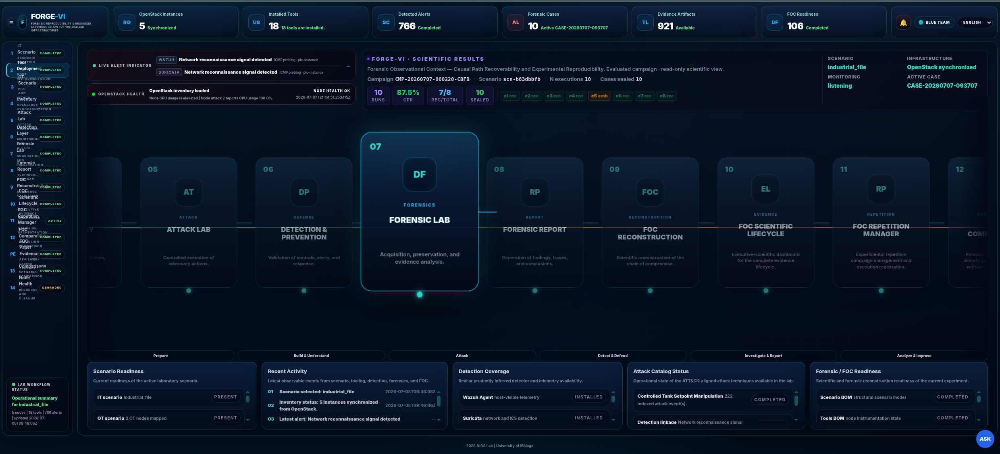

The workflow then moves from the global platform overview to scenario construction.

---

### 4.2 IT Scenario Editor

The **IT Scenario Editor** is used to create and deploy the base IT scenario on the virtualized infrastructure.

It allows the user to visually define the experimental topology by creating nodes, assigning roles, connecting them, and deploying the resulting scenario through the platform.

The editor supports:

- visual creation of IT nodes;
- role assignment, such as attacker, victim, and monitor;
- network and subnet configuration;
- image, flavor, key, and security-group selection;
- topology editing;
- scenario loading and saving;
- deployment and teardown actions.

This view defines the initial virtual environment on which tools, attacks, monitoring components, and forensic workflows are later applied.

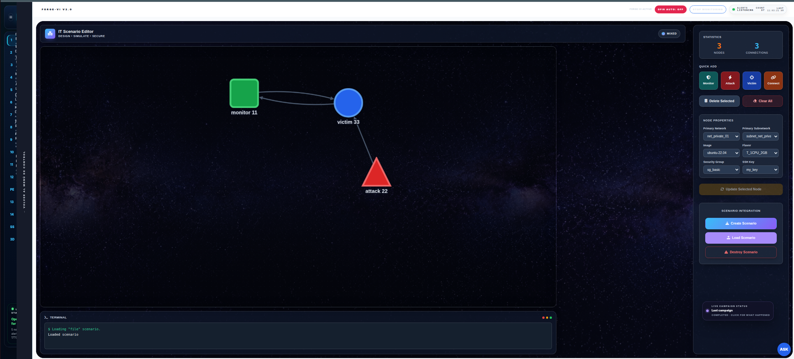

The IT scenario can then be extended with industrial components.

---

### 4.3 Industrial Scenario Editor

The **Industrial Scenario Editor** extends the base IT topology with OT-oriented components.

It allows the user to add industrial nodes such as PLC, SCADA, or HMI components and connect them to the existing IT scenario. This creates a virtualized IT/OT environment suitable for controlled industrial cybersecurity and DFIR experimentation.

The editor supports:

- loading the base IT scenario;
- adding PLC nodes;
- adding SCADA/HMI nodes;
- connecting industrial nodes to the topology;
- saving industrial extensions;
- opening deployed industrial services;
- removing industrial components when needed.

This view defines the industrial context required for OT-aware attack execution, detection, acquisition, and reconstruction.

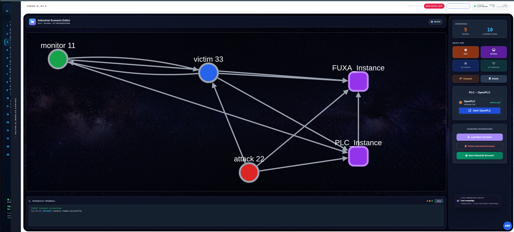

The deployed IT/OT environment can then be inspected through the environment dashboard.

---

### 4.4 IT/OT Environment Dashboard

The **IT/OT Environment Dashboard** provides an operational view of the deployed hybrid environment.

It helps the user inspect the current state of the virtualized IT/OT scenario and understand how the deployed nodes, services, and industrial components are organized.

It supports:

- visualization of the deployed environment;
- inspection of IT and OT roles;
- operational awareness of scenario components;
- access to node-level information;
- support for moving from deployment to tool installation and attack execution.

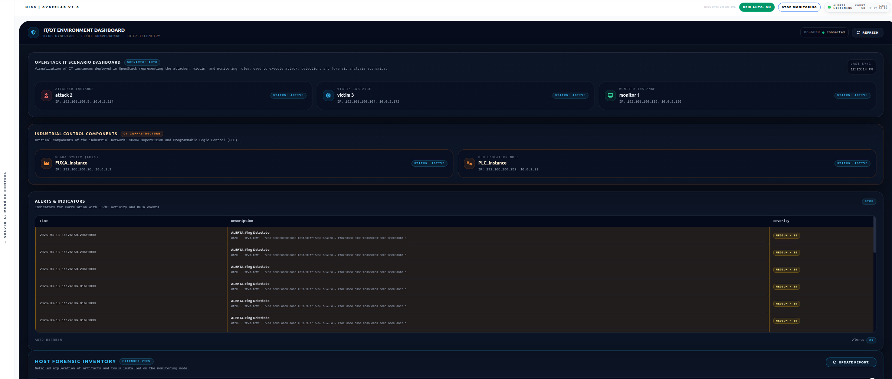

Once the environment is deployed, the required tools can be installed.

---

### 4.5 Instance Tools Manager

The **Instance Tools Manager** prepares deployed nodes with the tools required for experimentation, monitoring, attack execution, detection, and forensic acquisition.

It allows the user to select a deployed instance, choose tools from a predefined catalog, and launch installation workflows with live operational feedback.

The tool catalog includes:

- security monitoring tools;
- host and network sensors;
- offensive and assessment tools;
- OT/ICS utilities;
- forensic acquisition and analysis tools;
- industrial services;
- detection and rollback profiles.

This view connects infrastructure deployment with practical experimentation by making each node operationally ready for its role.

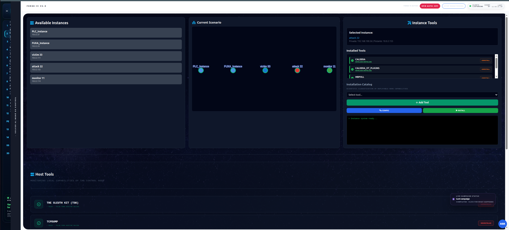

After tool installation, the user can access the deployed services from a role-oriented portal.

---

### 4.6 Security Training and Tools Portal

The **Security Training and Tools Portal** gives direct access to installed tools and services inside the deployed environment.

It organizes access according to scenario roles, such as attacker, monitor, victim, PLC, or SCADA/HMI. This allows the user to interact with real tools in the virtualized scenario rather than with simplified demonstrations.

The portal supports:

- role-based tool access;
- direct opening of installed services;
- access to remote instance consoles;
- operational interaction with attacker, victim, monitor, PLC, and SCADA/HMI nodes;
- hands-on training and experimentation.

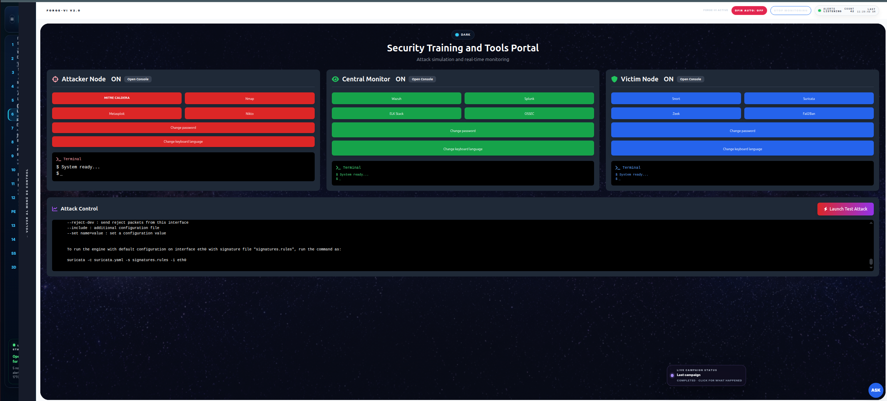

The prepared scenario can then be used for controlled attack execution.

---

### 4.7 Tactical Cyber Operations Dashboard

The **Tactical Cyber Operations Dashboard** provides the operational interface for controlled attack execution and scenario observation.

It combines target selection, attack execution, contextual node information, and operational feedback in a single interface.

The dashboard supports:

- battlefield-style scenario visualization;
- target selection;
- node intelligence;
- attack profile execution;
- attacker-side feedback;
- victim-side feedback;
- monitoring-side feedback;
- direct access to offensive and defensive tools.

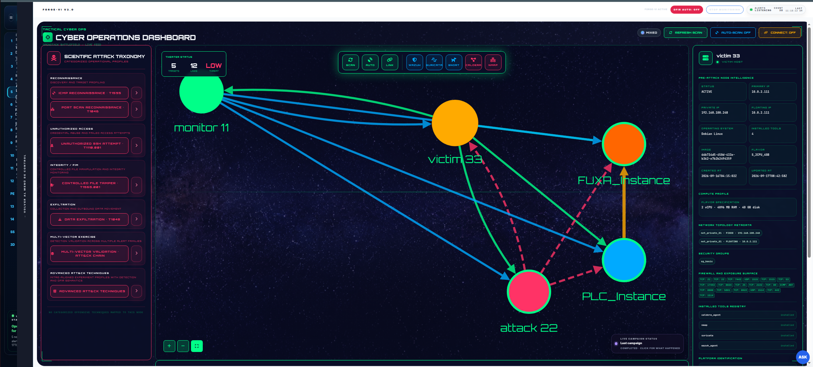

The dashboard also provides extended operational views for attack execution and feedback.

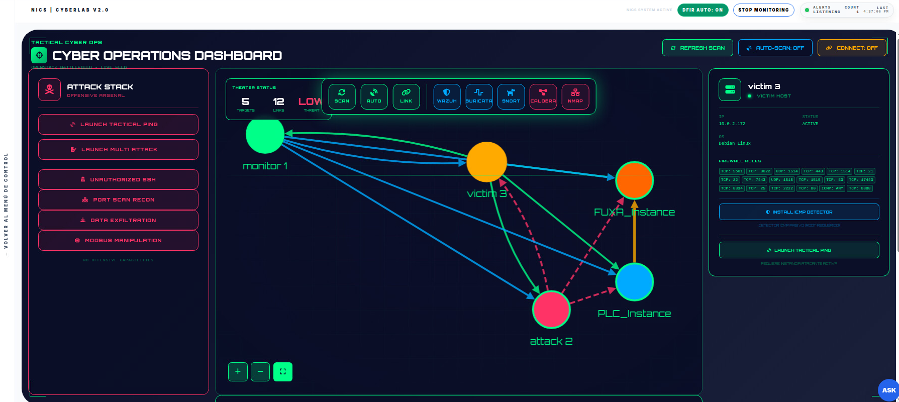

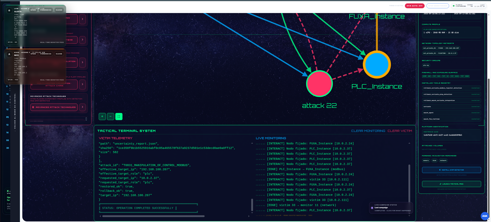

The attack workflow is linked to detection and forensic expectations.

---

### 4.8 Advanced Detection Module

The **Advanced Detection Module** exposes detection-oriented capabilities associated with the monitored scenario.

It supports the transition from controlled incident execution to alert observation and forensic escalation.

This module can be used to inspect:

- detection rules;
- alert behavior;
- monitoring status;
- detection profile state;
- expected detector outputs;
- security-event visibility.

It is especially relevant when attack profiles are expected to generate observable detection traces that later become triggers for acquisition and reconstruction.

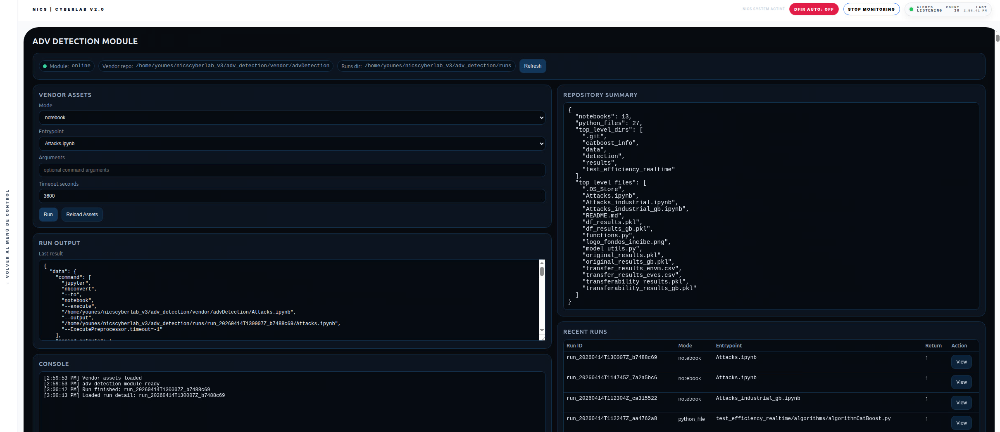

Detection can also include traffic-oriented analysis views.

---

The detected or observed incident can then be moved into the forensic workflow.

---

### 4.9 End-to-End Forensic Workflow View

The **End-to-End Forensic Workflow View** presents the forensic workflow as a complete process.

It helps the user understand the relation between incident execution, detection, acquisition, preservation, analysis, reporting, reconstruction, and comparison.

The workflow follows the sequence:

```text
incident execution
  -> detection
  -> trigger resolution
  -> acquisition
  -> preservation
  -> verification
  -> analysis
  -> reporting
  -> reconstruction
  -> comparison
```

This view connects operational activity with the case-centered DFIR process.

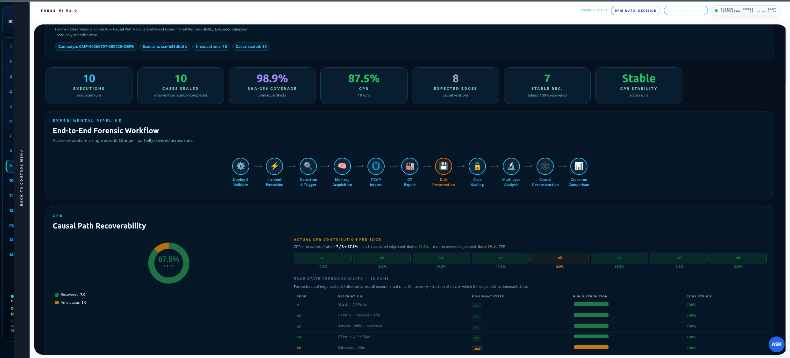

The next view executes evidence acquisition and preservation.

---

### 4.10 Forensic Acquisition Dashboard

The **Forensic Acquisition Dashboard** is used to acquire and preserve evidence from the deployed scenario.

It supports the creation of forensic cases from observed or triggered incidents.

The dashboard can manage:

- alert-triggered acquisition;
- manual acquisition when required;
- acquisition profile selection;
- case creation;
- memory acquisition;
- disk or snapshot preservation;
- network evidence import;
- alert preservation;
- OT/industrial evidence export;
- manifest generation;
- chain-of-custody registration;
- acquisition pipeline events.

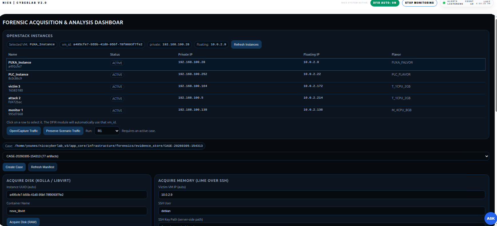

The dashboard also exposes detailed acquisition status and case-preservation information.

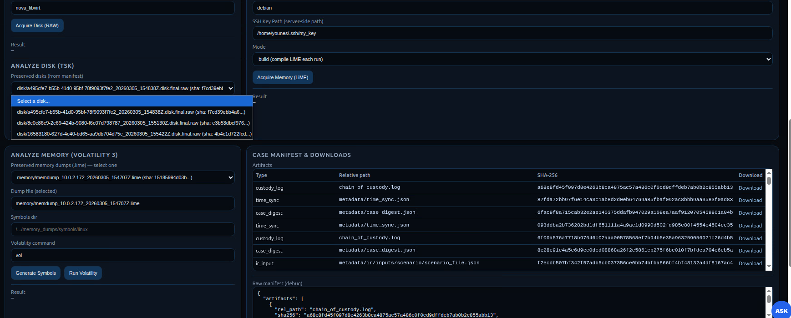

After acquisition, the preserved evidence can be inspected and analyzed.

---

### 4.11 Forensic Live Traffic Analyzer

The **Forensic Live Traffic Analyzer** supports network-oriented inspection during or after the incident workflow.

It helps the user interpret traffic observations and relate network activity to the preserved case.

It can support:

- traffic inspection;
- protocol-oriented analysis;
- network-event review;
- packet-level context;
- correlation with alerts and forensic case records.

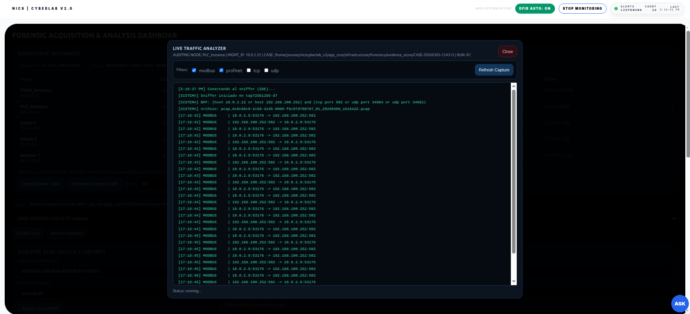

The next views expose the forensic report and analysis surfaces.

---

### 4.12 Digital Forensics Report and Analysis Dashboard

The **Digital Forensics Report and Analysis Dashboard** provides a case-centered view of preserved artifacts, integrity records, custody information, analysis outputs, and forensic summaries.

It allows the user to inspect:

- case identifier;
- preserved evidence inventory;
- evidence paths;
- manifest records;
- hash values;
- chain-of-custody entries;
- acquisition pipeline events;
- metadata records;
- analysis outputs;
- generated forensic summaries.

This dashboard separates primary evidence from derived analysis outputs, preserving the distinction between what was acquired and what was later produced by analysis.

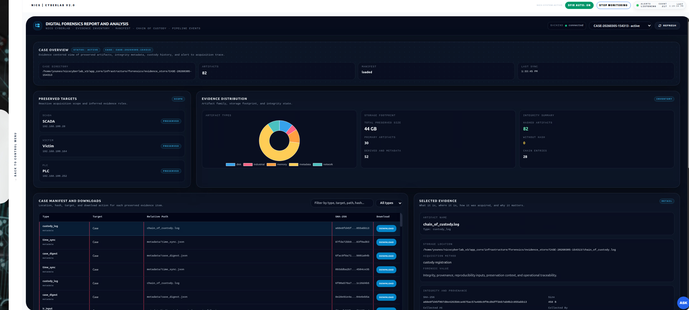

Additional report views expose detailed case information and analysis outputs.

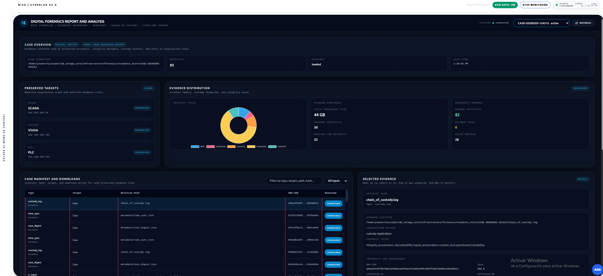

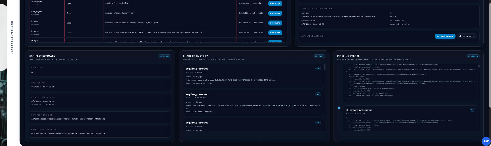

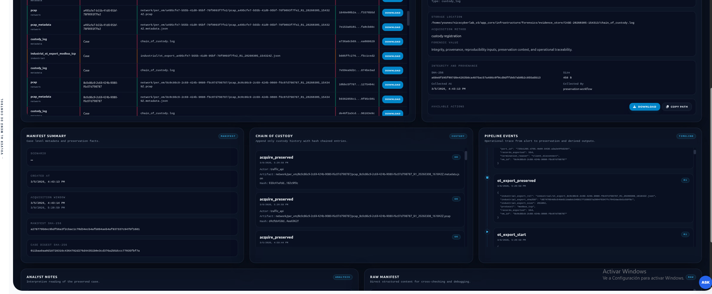

The preserved case can then be used for reconstruction and cross-run comparison.

---

### 4.13 FOC Reconstruction and Comparability View

The **FOC Reconstruction and Comparability View** organizes the preserved incident into a Forensic Observational Context and supports comparison across repeated executions.

The **Forensic Observational Context (FOC)** binds:

- incident window;
- trigger source;
- acquisition profile;
- preserved evidence layers;
- temporal anchors;
- integrity records;
- custody records;
- derived analysis outputs;
- uncertainty state;
- reconstruction criteria.

The view helps evaluate whether expected incident-to-evidence relations are:

- recovered;
- degraded;
- ambiguous;
- missing.

It also supports CPR-oriented interpretation, where Causal Path Recoverability summarizes how many expected causal relations are recoverable from preserved and analyzed evidence.

This view is important because it avoids treating preservation as equivalent to complete reconstruction. A case may be correctly preserved while still leaving some relations degraded, ambiguous, or unsupported.

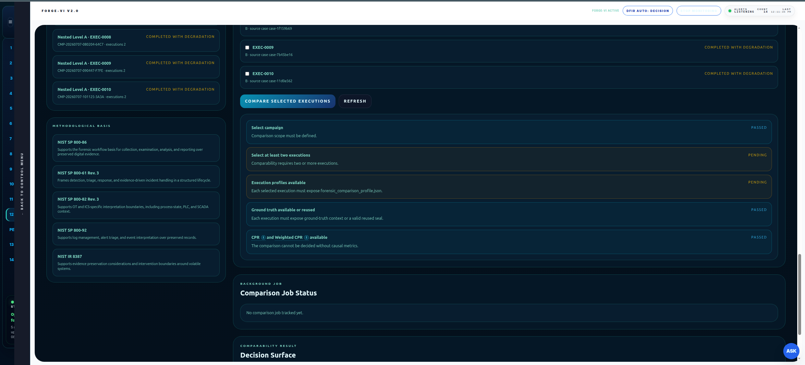

The final service supports movement of selected artifacts to external laboratory machines.

---

### 4.14 Remote Lab Exchange Dashboard

The **Remote Lab Exchange Dashboard** supports controlled exchange of selected artifacts between FORGE-VI and external analysis environments.

It can be used to:

- export selected files to a remote laboratory machine;
- retrieve external analysis outputs;
- support external tool execution;
- preserve the distinction between platform-managed evidence and externally produced results.

This service is useful when specialized tools are executed outside the platform while the main experiment remains organized through FORGE-VI.

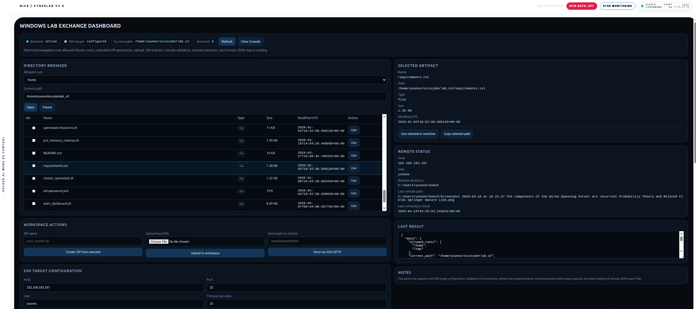

The next section describes the evidence model used by the forensic services.

---

## 5. Evidence Model

FORGE-VI treats evidence handling as part of the experimental procedure. Each incident execution can materialize as a forensic case under the evidence store.

A case is identified by a stable case identifier and contains preserved artifacts, metadata, integrity records, custody records, pipeline events, and derived analysis outputs.

### 5.1 Case as Experimental Unit

In FORGE-VI, the forensic case is the unit used for preservation, analysis, reconstruction, and comparison.

A case records:

- what incident triggered acquisition;
- what profile was selected;
- what evidence was collected;
- what artifacts were hashed;
- what custody events were recorded;
- what analysis outputs were generated;
- what reconstruction criteria were applied;
- what comparison outputs were exported.

### 5.2 Evidence-Store Layout

A typical case follows a structured layout such as:

```text
evidence_store/
  CASE-YYYYMMDD-HHMMSS/
    manifest.json
    chain_of_custody.log
    metadata/
    alerts/
    network/
    memory/
    disk/
    industrial/
    pipeline/
    timelines/
    derived/
    reports/
```

The exact content depends on the acquisition profile and scenario type.

### 5.3 Primary and Derived Artifacts

FORGE-VI separates primary evidence from derived artifacts.

Primary evidence includes preserved artifacts such as:

- memory images;
- disk images or snapshots;
- PCAP files;
- raw alerts;
- OT exports;
- metadata;
- custody records;
- hash records.

Derived artifacts include outputs generated by analysis, parsing, enrichment, reconstruction, or reporting.

Examples include:

- parsed network summaries;
- memory-analysis outputs;
- disk-analysis outputs;
- normalized timelines;
- cross-layer findings;
- reconstruction reports;
- executive summaries;
- comparison exports.

The next section explains how acquisition profiles populate this evidence model.

---

## 6. Acquisition and Preservation Model

FORGE-VI uses profile-conditioned acquisition. This means that the selected trigger and scenario context determine which acquisition procedure is executed.

### 6.1 Alert-to-Profile Resolution

The acquisition workflow follows this chain:

```text
Alert
  -> trigger identifier
  -> acquisition profile
  -> versioned procedure
  -> acquisition backend
  -> preserved case
```

The platform records:

- trigger time;
- trigger source;
- selected profile;
- selected procedure;
- parameters;
- acquisition start events;
- preservation events;
- outcomes;
- diagnostic context.

### 6.2 Evidence Sources

Depending on the active profile, FORGE-VI can preserve:

- network traffic;
- volatile memory;
- persistent host state;
- disk or snapshot artifacts;
- detector alerts;
- OT protocol exports;
- SCADA/HMI logs when exposed;
- metadata and timing records;
- acquisition pipeline events.

### 6.3 OT and Industrial Evidence

For IT/OT scenarios, the acquisition model includes industrial evidence beyond generic PCAP storage.

The platform can preserve structured OT exports such as:

- selected register ranges;
- selected coil ranges;
- setpoints;
- I/O values;
- protocol-specific observation metadata;
- address maps;
- sampling policy;
- UTC timestamps.

The evaluated industrial baseline is centered on Modbus/TCP-style observation, while the case-preservation structure is designed to remain protocol-agnostic at the evidence-store level.

### 6.4 Integrity and Custody

FORGE-VI records preservation and handling steps through:

- manifest entries;
- cryptographic hashes;
- chain-of-custody records;
- acquisition pipeline events;
- metadata files;
- verification outputs.

The platform can expose inconsistencies between declared actions and preserved records by keeping acquisition, preservation, and verification records inspectable.

The next section describes how controlled incident profiles connect the attack layer to detection and forensic expectations.

---

## 7. Attack and Detection Model

FORGE-VI uses controlled attack profiles to generate incident conditions under documented constraints.

Each attack profile can define:

- technique identity;
- target role;
- execution backend;
- safety constraints;
- expected detector;
- expected alert;
- expected forensic artifacts;
- rollback behavior;
- DFIR escalation flag;
- reconstruction expectations.

### 7.1 Controlled Incident Execution

The attack layer is designed for reproducible laboratory execution.

It supports:

- target selection;
- profile-constrained execution;
- role validation;
- backend script execution;
- output capture;
- rollback where required;
- linkage to expected evidence.

### 7.2 Detection Linkage

Detection profiles connect controlled attacks to observable evidence.

A detection workflow can preserve:

- detector-native alerts;
- normalized alert views;
- alert-to-trigger mappings;
- Wazuh events;
- Suricata outputs;
- OT-specific detection outputs;
- correlation metadata.

### 7.3 Safety and Scope

FORGE-VI attack profiles are intended for controlled laboratory scenarios deployed by the platform.

They are not intended for production systems, unauthorized networks, or uncontrolled environments.

The next section describes how preserved evidence is reconstructed and compared.

---

## 8. Reconstruction and Reproducibility

FORGE-VI separates preservation from reconstruction.

A case may be well preserved and still have degraded, ambiguous, or missing causal relations. The reconstruction layer makes this distinction explicit.

### 8.1 Reconstruction Objects

The reconstruction layer uses:

- incident window;
- preserved artifacts;
- analysis outputs;
- integrity records;
- custody records;
- trigger records;
- temporal metadata;
- expected relation models;
- uncertainty indicators.

### 8.2 Relation States

Expected relations are evaluated using explicit states:

```text
recovered
degraded
ambiguous
missing
```

These states help the platform express whether a relation is fully supported, partially supported, unresolved, or unsupported by the available evidence.

### 8.3 Reproducibility Levels

FORGE-VI supports repetition-oriented organization through:

```text
Level A -> re-analysis of the same sealed case
Level B -> repeated incident execution in the same deployed scenario
Level C -> redeployment-aware repetition and comparison
```

These levels allow the user to distinguish analytical repeatability, incident repetition, and redeployment-aware experimental comparison.

### 8.4 Scientific Memory and Comparison Families

FORGE-VI can organize repeated outputs into comparison families.

A comparison family can group cases according to:

- scenario profile;
- attack profile;
- acquisition profile;
- repetition level;
- evidence coverage;
- reconstruction criteria;
- exported scientific result profile.

This makes repeated executions easier to inspect and compare without mixing incompatible campaigns.

The next section gives a practical end-to-end usage sequence.

---

## 9. End-to-End Usage Sequence

A complete FORGE-VI workflow can be executed as follows.

### Step 1: Deploy the Infrastructure

```bash
bash openstack-installer/openstack-installer.sh
```

### Step 2: Start the Platform

```bash
bash start_dashboard.sh
```

### Step 3: Create the Base IT Scenario

Use the **IT Scenario Editor** to create nodes, assign roles, connect the topology, and deploy the scenario.

### Step 4: Extend the Scenario with OT Components

Use the **Industrial Scenario Editor** to add PLC, SCADA, or HMI components when the experiment requires an IT/OT setting.

### Step 5: Install Tools

Use the **Instance Tools Manager** to install required tools on the attacker, victim, monitor, PLC, SCADA/HMI, or forensic host.

### Step 6: Access Operational Tools

Use the **Security Training and Tools Portal** to open installed tools and interact with the deployed environment.

### Step 7: Execute a Controlled Incident

Use the **Attack Lab** or **Tactical Cyber Operations Dashboard** to select a target and launch a controlled attack profile.

### Step 8: Observe Detection

Use the monitoring and detection surfaces to observe whether the expected alert or telemetry was produced.

### Step 9: Acquire and Preserve Evidence

Use the **Forensic Acquisition and Analysis Dashboard** to trigger or execute the acquisition profile and create a preserved case.

### Step 10: Review the Case

Use the **Digital Forensics Report and Analysis Dashboard** to inspect the manifest, custody records, artifact inventory, pipeline events, and analysis outputs.

### Step 11: Reconstruct the Incident

Use the **FOC Reconstruction Dashboard** to bind the incident window, preserved artifacts, derived findings, uncertainty state, and expected relations.

### Step 12: Compare Repeated Executions

Use the **Forensic Repetition Manager** and **Forensic Reconstruction Comparability View** to compare cases generated under documented repetition conditions.

The next section lists the main strengths exposed by this workflow.

---

## 10. Key Platform Strengths

FORGE-VI provides:

- automated OpenStack-based infrastructure deployment;
- visual IT scenario construction;
- visual IT/OT scenario extension;
- role-aware node configuration;
- centralized tool installation;
- direct access to operational security tools;
- ATT&CK-aligned controlled attack profiles;
- integrated detection and alert handling;
- profile-conditioned forensic acquisition;
- volatility-aware preservation ordering;
- rolling PCAP and case-bound network import;
- memory, disk, network, alert, and OT evidence preservation;
- manifest-based integrity metadata;
- hash-linked custody recording;
- primary and derived artifact separation;
- post-acquisition forensic analysis;
- FOC-based reconstruction;
- causal relation state tracking;
- CPR-oriented reconstruction summaries;
- Level A, Level B, and Level C repetition organization;
- cross-run comparability views;
- research and training usability.

The next section maps these capabilities to repository paths.

---

## 11. Repository Structure

Important repository paths include:

```text
openstack-installer/
```

OpenStack deployment scripts and virtual environment setup.

```text
app_core/
```

Backend application logic, infrastructure services, attack catalog, forensic services, and orchestration components.

```text
app_core/infrastructure/attack/
```

Controlled attack profile catalog and execution support.

```text
PLC/
```

PLC-related resources, including prepared control programs.

```text
PLC/plc_programs/
```

Industrial control logic examples.

```text
Images_readme/
```

Images used by this README.

```text
evidence_store/
```

Case-level evidence store generated during forensic acquisition workflows.

```text
paper_exports/
```

Compact exports and scientific reporting artifacts generated from evaluated workflows.

The next section defines the intended scope of the platform.

---

## 12. Scope

FORGE-VI is designed for controlled virtualized experimentation, research, training, and reproducibility-oriented DFIR workflows.

It is intended for:

- local laboratory environments;
- controlled cybersecurity experimentation;
- virtualized IT/OT scenarios;
- educational exercises;
- forensic acquisition and preservation studies;
- post-incident reconstruction experiments;
- cross-run comparison of documented executions.

It is not intended for:

- unauthorized testing;
- uncontrolled production networks;
- safety-critical live industrial processes;
- certification of real-world forensic completeness;
- replacement of professional incident-response procedures in operational environments.

Physical process fidelity is intentionally bounded by the virtualized and instrumented nature of the platform. The platform prioritizes controlled repetition, evidence traceability, auditable preservation, reconstruction support, and comparative analysis.

The next section describes safe repository hygiene before sharing or publishing deployments.

---

## 13. Repository Hygiene

Before publishing or sharing a FORGE-VI deployment, check that the repository does not include environment-specific or sensitive files.

Avoid committing:

```text
admin-openrc.sh
app.log
app.log.*
wget-log
*.pem
*.key
*.env
__pycache__/
evidence_store/
large raw memory dumps
large disk images
large PCAP bundles
```

Use example templates when credentials or local paths are required:

```text
admin-openrc.example.sh
.env.example
```

Large forensic artifacts should normally be retained outside the public repository or shared through controlled transfer mechanisms.

The next section acknowledges the funding and institutional support behind the project.

---

## 14. Acknowledgments

This repository is part of the project **“CiberIA: Investigación e Innovación para la Integración de Ciberseguridad e Inteligencia Artificial”** (Proyecto C079/23), financed by the European Union NextGeneration-EU, the Recovery Plan, Transformation and Resilience, through INCIBE.

This work is also supported by the **Programa Global de Innovación en Seguridad** for the promotion of Cátedras de Ciberseguridad en España, funded by the European Union NextGeneration-EU Funds through the Instituto Nacional de Ciberseguridad (INCIBE).
